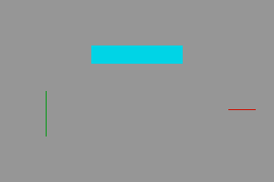

# Création d'une image numérique en Python

## 0. L'environnement logiciel nécessaire

### 0.1 Option 1 : installer Thonny sur son ordinateur

1. Rendez vous sur la page https://thonny.org/


2. Téléchargez et installez la version qui correspond à votre système d'exploitation (Windows, Mac, Linux).

3. Ouvrez Thonny et allez dans Outils / Gérer les paquets.
4. Dans la zone de recherche, tapez «pillow» puis cliquez sur «Recherchez sur PyPi».
5. Installez le paquet «pillow» qui vous est proposé.


### 0.2 Option 2 : utiliser en ligne le site repl.it

Rendez-vous sur la page https://repl.it/@G_Lassus/photonumactivite2


⚠ La modification de ce code ne pourra se faire qu'après inscription sur le site de repl.it. C'est pourquoi je préfère que, si possible, vous passiez par l'option 1, l'installation de Thonny sur votre ordinateur.

## 1. Premier code

### 1.1 Le code à recopier

```python
from PIL import Image
img = Image.new("RGB",(300,200))

for x in range(300):
    for y in range(200):
        img.putpixel((x,y),(150,150,150))


for a in range(100,200):
    for b in range(50,70):
        img.putpixel((a,b),(0,212,230))

for k in range(250,280):
    img.putpixel((k,120),(204,15,0))

for z in range(100,150):
    img.putpixel((50,z),(4,152,20))


img.save("mon_dessin.png")

``` 
- Copiez-collez ou recopiez le code suivant (si vous êtes  - passés par repl.it, il est déjà écrit). 
- Enregistrez votre travail dans un fichier (repérez bien à quel endroit ce fichier se trouve)
- Exécutez ce code (F5 sur Thonny). Un fichier ```mon_dessin.png```  est créé dans le même dossier que votre code python.

Votre image créée doit être celle-ci :




### 1.2 Aide à la compréhension du code


