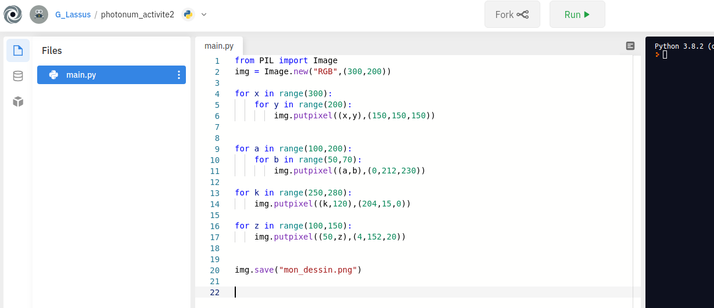
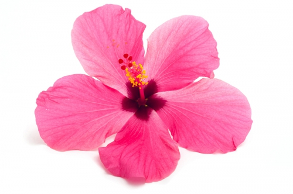

# Création d'une image numérique en Python

## 0. L'environnement logiciel nécessaire

### 0.1 Option 1 : installer Thonny sur son ordinateur

1. Rendez vous sur la page https://thonny.org/


2. Téléchargez et installez la version qui correspond à votre système d'exploitation (Windows, Mac, Linux).

3. Ouvrez Thonny et allez dans Outils / Gérer les paquets.
4. Dans la zone de recherche, tapez «pillow» puis cliquez sur «Recherchez sur PyPi».
5. Installez le paquet «pillow» qui vous est proposé.


### 0.2 Option 2 : utiliser en ligne le site repl.it

Rendez-vous sur la page https://repl.it/@G_Lassus/photonumactivite2



⚠ La modification de ce code ne pourra se faire qu'après inscription sur le site de repl.it. C'est pourquoi je préfère que, si possible, vous passiez par l'option 1, l'installation de Thonny sur votre ordinateur.

## 1. Premier code

### 1.1 Le code à recopier

```python
from PIL import Image
img = Image.new("RGB",(300,200))

for x in range(300):
    for y in range(200):
        img.putpixel((x,y),(150,150,150))


for a in range(100,200):
    for b in range(50,70):
        img.putpixel((a,b),(0,212,230))

for k in range(250,280):
    img.putpixel((k,120),(204,15,0))

for z in range(100,150):
    img.putpixel((50,z),(4,152,20))


img.save("mon_dessin.png")

``` 
- Copiez-collez ou recopiez le code suivant (si vous êtes  - passés par repl.it, il est déjà écrit). 
- Enregistrez votre travail dans un fichier (repérez bien à quel endroit ce fichier se trouve)
- Exécutez ce code (F5 sur Thonny). Un fichier ```mon_dessin.png```  est créé dans le même dossier que votre code python.

Votre image créée doit être celle-ci :


### 1.2 Aide à la compréhension du code


## 2. Des fonctions pour de jolies images !

Pour l'instant nos pixels sont tous de la même couleur, et c'est un peu décevant...

Nous allons repartir avec le code ci-dessous :

```python
from PIL import Image

largeur = 600
hauteur = 600

img = Image.new("RGB",(largeur,hauteur))

for x in range(largeur):
    for y in range(hauteur):
        r = 255
        g = 255
        b = 255
        img.putpixel((x,y),(r,g,b))


img.save("exemple.png")
```

L'image produite est : blanche.

### 2.1 Un peu (beaucoup) d'aléatoire
Au début du code, rajoutez la ligne 
```python
from random import randint
```

Cela nous donne le droit d'utiliser la fonction ```randint()```, qui reçoit deux nombres entiers en paramètres, et qui renvoie un nombre pseudo-aléatoire entre ces deux nombres.

Voilà un simulateur de dé à 6 faces :
```
>>> randint(1,6)
4
``` 


**Exercice 1** 
Dans le code précédent, remplacer la valeur de chaque composante RGB (actuellement à 255) par un nombre aléatoire entre 0 et 255.

À quoi ressemble l'image produite ?
(on appelle cela du *bruit blanc*)


### 2.2 Les mathématiques au service de l'esthétique

Nous souhaiterions que la teinte des pixels change en fonction des coordonnées ```(x,y)``` de celui-ci.

Pour cela, nous allons, par exemple, essayer le code suivant :

```python
def f(x, y):
    return x + y

for x in range(largeur):
    for y in range(hauteur):
        r = f(x,y)
        g = 255
        b = 255
        img.putpixel((x,y),(r,g,b))

```
Essayez de comprendre pourquoi l'image possède une grande zone de blanc.

**Un opérateur important : %**

Nous allons avoir recours à un opérateur mathématique très important en programmation, l'opérateur ```%```, appelé «modulo» :

```a % b```  renvoie le reste de la division euclidienne de ```a```  par ```b```. 

Exemple :
```
>>> 13 % 5
3
>>> 9 % 7
2
>>> 260 % 255
5

``` 

Cet opérateur est très souvent utilisé pour éviter à une variable de dépasser une certaine borne.

Ainsi, si ```z```  est un nombre entier, ```z % 255``` sera un nombre toujours compris dans l'intervalle ```[0;254]```


**Exercice 2** 
Reprenez le code précédent et utilisez le modulo intelligemment.


**Exercice 3** 
Modifiez la fonction ```f``` (faites parler votre imagination) et observez les résultats obtenus.

**Exercice 3** 
Modifiez la fonction ```f``` afin qu'elle renvoie la distance du point de coordonnées ```(x,y)``` avec le centre de l'image. (modulo 255 bien sûr).
Admirez votre création !


## 3. Modifier la couleur d'une image existante
Nous allons jouer avec les pixels de l'image ci-dessous.



- Téléchargez l'image ci-dessus (par un clic-droit puis _Enregistrez l'image_).
- Ouvrez Thonny, et enregistrez votre fichier ```code_fleur.py``` dans **le même répertoire** que l'image ```fleur.jpg``` que vous venez de télécharger.  

Copiez-collez ensuite ce code :

```python
from PIL import Image

img_base = Image.open("fleur.jpg")
img_modif = Image.new("RGB", img_base.size)

largeur = img_base.width
hauteur = img_base.height


for x in range(largeur):
  for y in range(hauteur):
    pixel = img_base.getpixel((x, y))
    r = pixel[0]
    g = pixel[1]
    b = pixel[2]
    
    new_r = r
    new_g = g
    new_b = b
    
    new_pixel = (new_r, new_g, new_b)
    img_modif.putpixel((x, y), new_pixel)

img_modif.show()    
img_modif.save("new_fleur.jpg")
```

Exécutez ce code (F5) et observez l'image créée. 
Elle est, pixel par pixel, identique à l'image originale.

Mais essayez maintenant de modifier le contenu des variables ```new_r```, ```new_g```, ```new_b```... et observez le résultat !   

## 4. Activité finale : changer l'arrière-plan d'une image
Vous avez déjà vu des extraits vidéos où un acteur tourne devant un fond vert, fond vert qui sera ensuite remplacé par une autre incrusatation vidéo au montage final. 

Nous sommes maintenant capables de faire (à peu près...) la même chose avec quelques lignes de Python.

#### 4.1 Les images de travail
Notre personnage sera l'acteur John Travolta, héros du mème [confused Travolta](https://knowyourmeme.com/memes/confused-travolta). 

**update :** vous pouvez aussi travailler avec Bernie Sanders, candidat (malheureux) à la primaire démocrate aux US en 2020.

Nous disposons donc des images [john.bmp](data/john.bmp) et [bernie.bmp](data/bernie.bmp) :


et d'une image de même taille, [hall.png](data/hall.png), où vous reconnaîtrez le hall du lycée :


L'objectif est bien sûr d'intégrer John Travolta (ou Bernie Sanders) dans le hall du lycée.

### 4.2 Fusion des deux images

Nous savons :
- parcourir tous les pixels d'une image (avec une double boucle)
- récupérer la valeur d'un pixel (avec ```getpixel()``` )
- modifier la valeur d'un pixel (avec ```putpixel()``` )
- faire des tests avec ```if```...

Nous avons donc tous les outils nécessaires pour accueillir John Travolta  ou Bernie Sanders dans le hall du lycée : à vos claviers !

