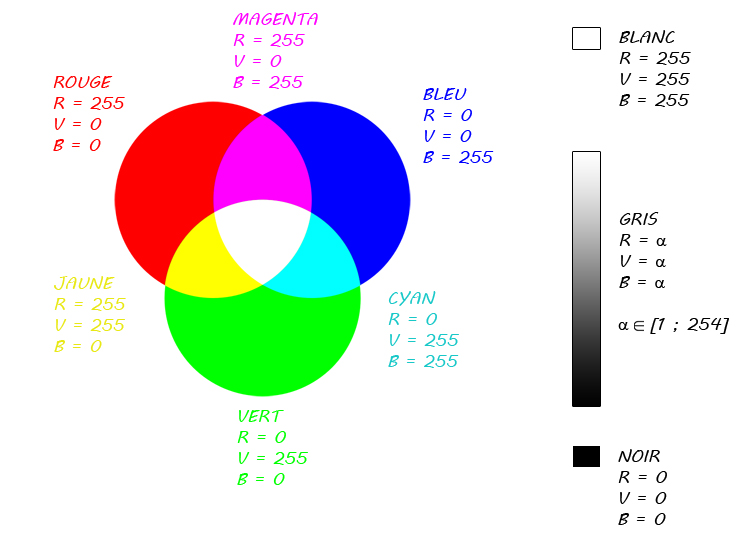

# L'image numérique

## 1. Vidéo introductive
<iframe width="790" height="444" src="https://www.youtube.com/embed/UnNPNc-F9ks" title="YouTube video player" frameborder="0" allow="accelerometer; autoplay; clipboard-write; encrypted-media; gyroscope; picture-in-picture" allowfullscreen></iframe>

## 2. Le pixel

### 2.1 Une image est composée de pixels
Le **pixel** (contraction de «Picture Element») est l'élément de base d'une image numérique.

Une image numérique se présente sous la forme d’un quadrillage - ou d'un tableau - dont chaque case est un pixel d’une couleur donnée. On peut donc repérer chaque pixel par sa ligne et sa colonne dans ce quadrillage, à l'aide de coordonnées en partant du coin en haut à gauche
{: .center }

### 2.2 Comment un écran affiche-t-il des pixels ?

L'observation à la loupe de différents écrans de téléphone donne ceci :
{: .center}

Pour afficher une image sur un écran de téléphone, seules trois couleurs sont donc disponibles : le rouge, le vert et le bleu.
Comment ces 3 couleurs peuvent-elles générer toutes les autres couleurs ?


## 3. Le codage RGB


!!! info "Le codage RGB"
    Chaque pixel correspond à un triplet de trois nombres entiers, soit les valeurs de rouge (Red), de vert (Green) et de bleu (Blue) afin de reconstituer la couleur. Chaque valeur est codée entre 0 et 255. On parle de code RGB (RVB in français).

    {: .center} 

    À noter qu'une couleur dont les 3 composantes sont identiques correspond à un niveau de gris.


[Ce site](https://htmlcolorcodes.com/fr/) (parmi beaucoup d'autres !) permet de retrouver le codage RGB d'une couleur. Il permet aussi de trouver le codage html d'une couleur, qui est basé sur le système hexadécimal.

??? info "la base 16 : l'hexadécimal"
    L'inconvénient essentiel du système binaire est la longueur de l'écriture des nombres qu'il génère. Pour cette raison, le **système hexadécimal**, ou système de **base 16** est très souvent employé.

    - Pour écrire en base 2, il faut 2 chiffres différents : le 0 et le 1.  

    - Pour écrire en base 10, il faut 10 chiffres différents: 0,1,2,3,4,5,6,7,8,9.  

    - Pour écrire en base 16, il faut donc 16 chiffres différents : **0,1,2,3,4,5,6,7,8,9,A,B,C,D,E,F**.    


    On a donc la correspondance :

    - A représente 10  
    - B représente 11  
    - C représente 12  
    - D représente 13  
    - E représente 14  
    - F représente 15 

    |256|16|1|
    |:---:|:---:|:---:|
    |$16^2$|$16^1$|$16^0$|
    | 1| D|2|


    $\rm{1D2}_{16}=1 \times 16^2+ 13 \times 16^1+2 \times 16^0=256+208+2=466_{10}$
    
    Le nombre hexadécimal `1D2` correspond donc au nombre décimal 466.
    
    
    En pratique, l'hexadécimal est surtout utilisé pour sa capacité à représenter la valeur de n'importe quel octet sur 2 chiffres ("chiffres" étant à prendre au sens large = chiffres ou lettres !).
 
    !!! example "Exercice"
        === "Énoncé"
            1. Donner la valeur des octets `FF`, `3A`, `B2`.
            2. Expliquer pourquoi la couleur RGB (138,255,51) a pour code html `#8AFF33`.
            3. Quelle est la couleur html du blanc ?


!!! example "Exercice 1"
    === "Énoncé"
        1. Quel est la valeur décimale d'un octet uniquement composé de 1 ?
        2. Si on considère que la couleur d'un pixel est codée sur 3 octets (un octet pour chaque composante R, G ou B), quel est le nombre de couleurs possibles pour ce pixel ?
        3. Si je possède une image de 600 pixels sur 400 pixels, quel est le poids (en octets, puis en Ko, puis en Mo) de cette image ? On considèrera que le fichier ne contient que les informations relatives à chaque pixel, et qu'aucun algorithme de compression n'a été utilisé.
    === "Correction"
        

!!! example "Exercice 2"
    === "Énoncé"
        Un ami m'envoie une photo de ses vacances. Le fichier de son image (en admettant qu'il ne contienne que le codage des pixels et rien d'autre, ce qui est faux...) commence par ceci :

        ```000011000001000111100110000011010001000111100100000010100000111111101000...```
        
        Est-ce que mon ami a beau temps pour ses vacances ?

    === "Correction"
        